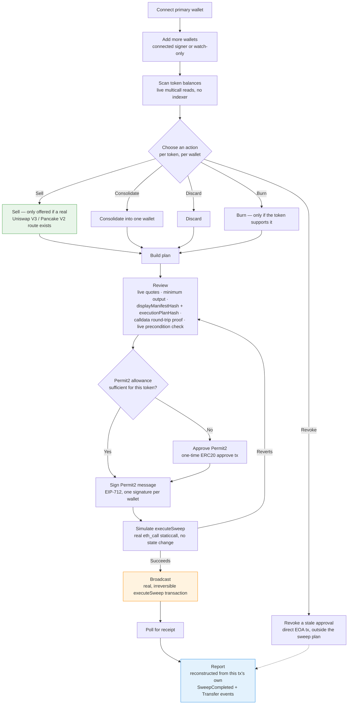

# TIDYR

Multi-wallet cleanup for Monad mainnet — scan every wallet, decide what to
sell, consolidate, discard, or burn, and understand every transaction before
you sign.

## The problem

Testing new chains and farming airdrops means running multiple wallets. Every
one of them ends up littered with dust: tiny leftover token balances from
demos, bridges, and one-off experiments that aren't worth the gas or the time
to deal with individually. Going wallet-by-wallet, token-by-token, deciding
"sell this, send that one to my main wallet, discard this dead token" and
then manually building and signing each transaction is exactly the kind of
repetitive, error-prone busywork that shouldn't need a human doing it by
hand.

## What TIDYR does

TIDYR is a single terminal over every wallet you use. Connect your primary
wallet, add any number of others (either as connected signers or watch-only
addresses), and TIDYR reads real balances across all of them in parallel. For
every token in every wallet, you choose what happens to it — **sell** it for
MON or USDC, **consolidate** it into one wallet, **discard** it, **burn** it
(where the token supports it), or **revoke** a stale approval. Nothing is
guessed: a "sell" option only ever appears when a real, live Uniswap V3 pool
or Pancake V2 pair actually exists for that token — if there's no real
liquidity, TIDYR says so instead of inventing a route.

Once you've built a plan, TIDYR shows you exactly what will happen before you
sign anything: the real tokens and amounts, a live quote for every sale, the
minimum output your slippage tolerance allows, and two independent hashes (a
human-readable manifest hash and the exact on-chain execution hash) — proven
to survive an ABI encode/decode round-trip losslessly, so what you review is
provably what will execute. Only then do you sign a single Permit2 message
per wallet — a signature that authorizes exactly that plan and nothing else,
and which never broadcasts anything by itself. A final read-only simulation
runs against the real, frozen `SweepExecutor` contract before a distinct,
explicit "Broadcast" action sends the actual transaction. Afterward, TIDYR
reconstructs a report straight from that transaction's own on-chain events —
never from a database, because there isn't one.

Every step above is a real read or a real write against Monad mainnet. There
is no backend, no off-chain simulation service, and no cached/mocked data
anywhere in the flow — see [`ARCHITECTURE.md`](ARCHITECTURE.md) for exactly
how that's structured, and [`SECURITY.md`](SECURITY.md) for how the contracts
that make it safe to sign against were verified.

## Why Monad

Cleaning up N wallets means broadcasting a transaction from each of them. On
most chains that's N separate wait-for-confirmation cycles, one after
another — clean up five wallets and you're watching a spinner five times,
possibly over several minutes.

Monad executes independent transactions in parallel: three wallets selling
three different tokens don't touch the same state, so they don't have to
queue behind each other — they can be included and confirmed in the same
block. That's not a cosmetic speedup; it's the actual reason a "multi-wallet"
product makes sense as a product at all. On a slower, strictly serial chain,
"clean up every wallet you own" isn't meaningfully faster than doing it by
hand one wallet at a time. To be precise about what this does and doesn't
mean: each wallet still requires its own signature — Monad doesn't remove
that human step, it removes the multi-minute wait *between* them (see
`docs/research/monad-source-map.md` §6 for the exact wallet-signing model
this is built on, corrected from an earlier, looser assumption).

Monad's consensus (MonadBFT) also reaches real finality fast — around 800ms,
verified directly against the live chain, not taken from a marketing figure
(`docs/research/monad-source-map.md` §2). TIDYR's execution monitor
deliberately waits for that actually-finalized state before ever calling a
sweep "done," rather than the optimistic first-seen/pending state most block
explorers show immediately.

And none of this required different code: Monad is fully EVM-compatible, so
`SweepExecutor` and its adapters are ordinary Solidity contracts, tested with
the same Foundry tooling used on Ethereum, deployed with zero chain-specific
changes — the parallelism and fast finality are properties of the chain
underneath, not something the contracts had to be written differently to get.

## How it works, end to end



**Live status:** contracts deployed and permanently frozen on Monad mainnet
(chain 143). The full sweep flow — scan wallets, plan actions, review the
exact plan with live quotes, approve Permit2, sign, simulate and broadcast
execution, and reconstruct a report from real on-chain logs — is built end
to end and has been exercised with real, broadcasted mainnet transactions
(see [`STAGING_DEPLOYMENT_REPORT.md`](STAGING_DEPLOYMENT_REPORT.md)).

**Live app:** [tidyr-web-production.up.railway.app](https://tidyr-web-production.up.railway.app)

## Deployed contracts (Monad mainnet, chain 143)

All nine contracts are deployed and **independently source-verified** on
MonadScan — click through to read the exact deployed source. `SweepExecutor`
and both adapters are additionally **permanently frozen**
(`configurationFrozen() == true`, no `unfreeze` exists — see
[`PHASE_10_COMPLETION_REPORT.md`](PHASE_10_COMPLETION_REPORT.md)).

| Contract | Role | Address |
| --- | --- | --- |
| [`SweepExecutor`](https://monadscan.com/address/0x7a844005998e896967a8b2bda13c7826f387e9c3) | Core execution contract — pulls tokens via Permit2, runs swaps through exactly two fixed adapters, settles output, returns remainders. Frozen. | `0x7a844005998e896967A8b2BdA13c7826F387E9c3` |
| [`UniswapV3Adapter`](https://monadscan.com/address/0xe80d042fbdc03da8262ed0669c75a394d2437d27) | Routes swaps through Uniswap V3 pools. One of exactly two adapters `SweepExecutor` can ever call. Frozen. | `0xE80d042fBDC03Da8262ED0669c75a394d2437D27` |
| [`PancakeV2Adapter`](https://monadscan.com/address/0xbb86d6ef057f03ca0bcab9f87b61894977b0dbcb) | Routes swaps through Pancake V2 pairs. The other of exactly two fixed adapters. Frozen. | `0xBB86D6ef057F03Ca0bcaB9f87B61894977B0dBcb` |
| [`DemoDistributor`](https://monadscan.com/address/0x49552a355ccb700e8ab18e392f1b05f0005c2d9e) | One-time faucet: 200 of each DUST1-5 per claiming address, for trying the product without owning real dust. | `0x49552A355cCB700E8Ab18e392F1B05F0005C2d9E` |
| [`DUST1`](https://monadscan.com/address/0x196f8a0d53fc71ccbc672d81b55754fa5b9438a5) | Fixed-supply demo token, no real market — used to show an honest "no route available" state. | `0x196f8a0d53fC71ccbc672D81b55754fA5B9438A5` |
| [`DUST2`](https://monadscan.com/address/0x4825cb1fcb1d3bb39bfbe15f477115937d46d960) | Fixed-supply demo token, no real market. | `0x4825cb1FCb1D3bB39bFbE15F477115937D46D960` |
| [`DUST3`](https://monadscan.com/address/0x1b7eb110bdc1d0b7f85046ec812be77958e8b3c3) | The one demo token with a real Uniswap V3 pool against WMON — the only token that gets a real, executable sell route. | `0x1B7EB110BDc1D0b7F85046EC812Be77958E8b3c3` |
| [`DUST4`](https://monadscan.com/address/0x645d6a93919362477cf625bd2db9d802b27097e2) | Fixed-supply demo token with a real `burn()` function — used to demonstrate the Burn action. | `0x645d6a93919362477Cf625Bd2Db9D802B27097E2` |
| [`DUST5`](https://monadscan.com/address/0xb9b200e7b56b6180e87c7f927a040647d8529e2f) | Fixed-supply demo token, no real market. | `0xB9b200e7b56B6180e87c7F927a040647D8529E2F` |

Full deployment record (every transaction hash, block number, and
constructor argument): [`deployments/mainnet.json`](deployments/mainnet.json).

| Doc                                                                                                | What it's for                                                                            |
| -------------------------------------------------------------------------------------------------- | ---------------------------------------------------------------------------------------- |
| [`ARCHITECTURE.md`](ARCHITECTURE.md)                                                               | System architecture — what's real vs. stubbed, contract layer, frontend layer, data flow |
| [`SECURITY.md`](SECURITY.md)                                                                        | Security model, threat coverage, and audit trail summary                                 |
| [`CONTRIBUTING.md`](CONTRIBUTING.md)                                                                | How this repo is worked on — branches, validation, secret handling                        |
| [`DEMO_VIDEO_SCRIPT.md`](DEMO_VIDEO_SCRIPT.md)                                                       | Shot-by-shot script for the product demo video                                           |
| [`tidyr-production-prd.md`](tidyr-production-prd.md)                                               | Full product requirements (the long-term target)                                         |
| [`docs/threat-model.md`](docs/threat-model.md), [`docs/security-model.md`](docs/security-model.md) | Full-detail security design (summarized in `SECURITY.md`)                                |
| [`PHASE_7_SECURITY_COMPLETION_REPORT.md`](PHASE_7_SECURITY_COMPLETION_REPORT.md)                   | Independent contract security audit                                                      |
| [`PHASE_10_COMPLETION_REPORT.md`](PHASE_10_COMPLETION_REPORT.md)                                   | Real mainnet route proof, smoke test, and freeze                                         |
| [`STAGING_DEPLOYMENT_REPORT.md`](STAGING_DEPLOYMENT_REPORT.md)                                     | Live frontend staging deployment details                                                 |
| [`docs/frontend-integration-matrix.md`](docs/frontend-integration-matrix.md)                       | Frontend: real vs. stubbed capability, per screen                                        |
| [`deployments/mainnet.json`](deployments/mainnet.json)                                             | Canonical deployed contract addresses and transaction history                            |

## Repository layout

```
apps/
  web/        Next.js frontend (real, chain-only, deployed)
  api/        Backend API (stub — liveness endpoint only)
  indexer/    Event indexer (stub)
packages/
  contracts/            Foundry workspace — SweepExecutor, adapters, tests
  shared/                Deployed addresses, Zod schemas, adapter-kind enum
  transaction-review/    Canonical manifest + execution-plan hashing
  routing/               Stub (frontend has its own chain-only routing reads)
  execution/             Stub (no execution wiring built yet)
deployments/
  mainnet.json           Source of truth for every deployed address/tx
docs/                     Detailed architecture/security/PRD-support documents
artifacts/                Phase-by-phase verification evidence (security, Phase 10, frontend)
```

This is a `pnpm` workspace monorepo (see `pnpm-workspace.yaml`). Every
package/app is built, typechecked, linted, and tested from the repo root.

## Requirements

- Node.js `>=22.6.0 <25` (see `engines` in `package.json`)
- `pnpm@10.33.0` (pinned via `packageManager`; enable with `corepack enable`)
- [Foundry](https://getfoundry.sh) for `packages/contracts`

## Quickstart

```bash
pnpm install --frozen-lockfile

# Frontend (apps/web)
pnpm --filter @tidyr/web dev          # http://localhost:3000

# Whole workspace
pnpm format:check
pnpm lint
pnpm typecheck
pnpm test
pnpm build

# Contracts (packages/contracts)
pnpm contracts:build
pnpm contracts:test
```

Copy `.env.example` for the shape of every environment variable this project
uses. Real secrets (`DEPLOYER_PRIVATE_KEY`, API keys) belong only in
gitignored, untracked `.env.deploy` / `.env.local` files — never commit
them, and never add a private key to any hosting provider's environment
configuration. See `ARCHITECTURE.md`'s Infrastructure section.

## Contributing

See [`CONTRIBUTING.md`](CONTRIBUTING.md).

## Security

See [`SECURITY.md`](SECURITY.md).

## License

MIT — see [`LICENSE`](LICENSE).
